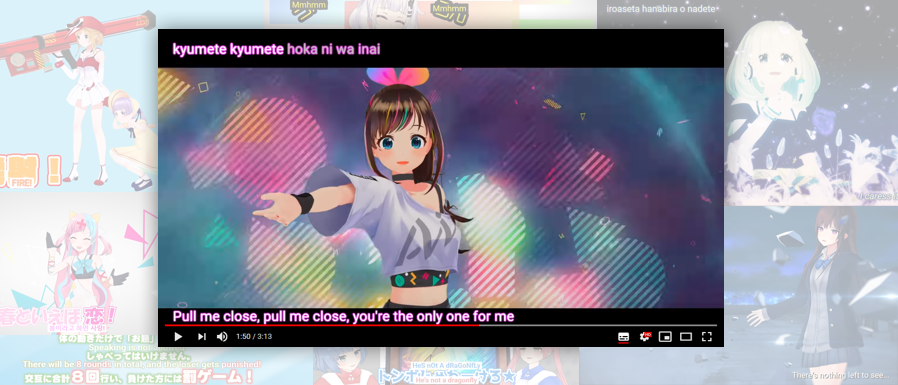
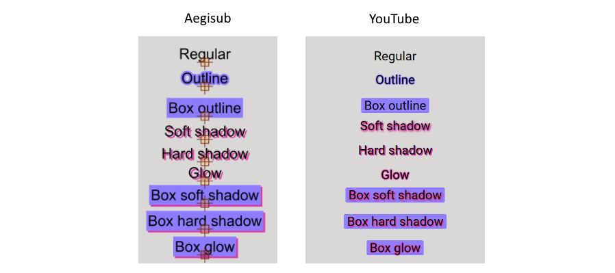
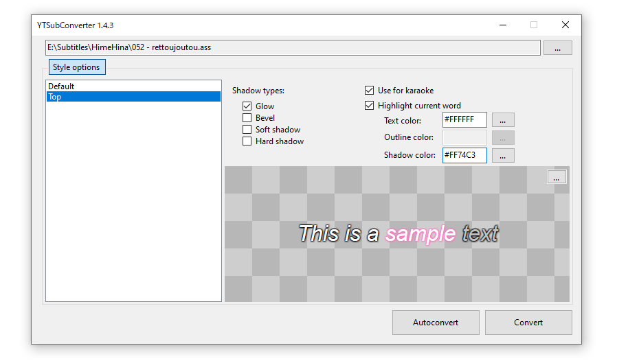
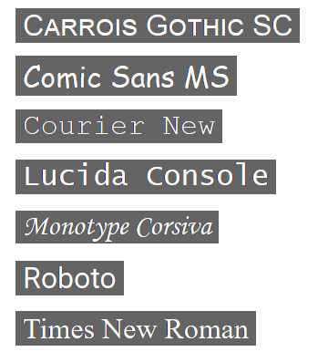
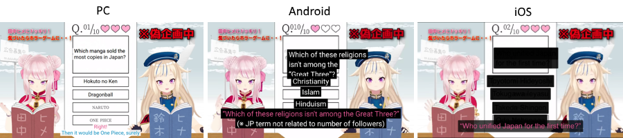

# YTSubConverter
A tool for creating styled YouTube subtitles.
 

## About this tool
YouTube's built-in subtitle editor doesn't support styling of any kind. If you want formatting such as bold, italic and coloring, you need to upload a subtitle file instead. The site accepts a number of file formats such as RealText, WebVTT and TTML, but all of these come with their own limitations - and most importantly, none of them give access to the full array of features offered by the YouTube player. For that, you need to use a YouTube-specific format called SRV3 (also referred to as YTT for "YouTube Timed Text"). It supports the following:
* Bold/italic/underline
* Text coloring and transparency
* Background coloring and transparency (including hiding the background box completely)
* Outlines, glows and drop shadows
* Fonts and font sizes
* Positioning (place your subtitles anywhere on the video)
* Karaoke timing (make the syllables of a song lyric appear as they're sung)
* Vertical text
* Ruby text

YTSubConverter can produce this file format for you.

The current version is **1.6.3** and is available for Windows, macOS and Linux (the Linux version requires Mono).

## Usage
YTSubConverter is primarily an .ass → .ytt converter. You can create .ass subtitles using [Aegisub](https://github.com/wangqr/Aegisub/releases).

Conversion is straightforward: launch the program, open your .ass file and click Convert. Alternatively, drag the .ass straight onto the .exe (Windows only). In both cases, you'll get a .ytt file that's ready for upload.

The program tries to approximate the look of the Aegisub subtitles as closely as possible on YouTube:

You'll notice that each .ass shadow can turn into one of four different YouTube shadow types: glow (same as outline), bevel, soft shadow and hard shadow. You can even combine multiple shadow types if you want - just choose from the checkboxes in the conversion UI. This is also where you can configure current word highlighting for karaoke.

Apart from converting from .ass to .ytt, the tool can also convert from .sbv (the format you get when downloading subs from YouTube's built-in editor) to .srt. This allows you to download existing, unstyled subs and add styling to them. Simply open the .sbv file, click Convert, and open the resulting .srt file in Aegisub.

Conversion between .ttml and .ytt is also possible. YouTube already supports uploading TTML files directly, but this support is rather limited - if you convert to .ytt and upload that instead, you get access to more features, not to mention workarounds for YouTube bugs. That being said, certain features like karaoke and transitions are still only available through .ass.

## ASS feature support
YTSubConverter supports the following .ass style features:
* Font name. YouTube only allows the following fonts:

(Roboto is the YouTube default; the tool will automatically pick this if the specified font is not allowed)
* Font size. The "Default" style (or the first style if there is no "Default") always gets the standard YouTube font size no matter what you pick, while the other styles are relative to it. For example, if the "Default" style has size 15 in Aegisub and the "Header" style has 30, these will be respectively at 100% and 200% of the standard size in YouTube. Note that you can't go lower than 75% and that the Android app always uses the same size no matter what you specify.
* Bold, italic, underline
* Primary, secondary, outline and shadow color
* Alignment. Note that on YouTube, apart from the usual effect on the subtitle's position, the alignment also influences how subtitles move when users hover their mouse over the video: top-aligned subtitles (alignments 7, 8 and 9) will move downwards, center-aligned subtitles (alignments 4, 5 and 6) will stay in place, and bottom-aligned subtitles (alignments 1, 2 and 3) will move upwards.
* Outline thickness and shadow distance (only checking whether the value is 0 or greater than 0)

It also supports the following [override tags](https://aegi.vmoe.info/docs/3.0/ASS_Tags/):
* `{\b}` - bold
* `{\i}` - italic
* `{\u}` - underline
* `{\fn}` - font. (See above for list of allowed fonts)
* `{\fs}` - font size. This tag is relative to the size of the "Default" style (or the first style if there is no "Default"). For example, if the "Default" style has size 15 and you put `{\fs30}`, the YouTube subtitle will be twice the standard size. Note that you can't go lower than 75% and that the Android app always uses the same size no matter what you specify.
* `{\c}` or `{\1c}` - regular text color
* `{\2c}` - unsung karaoke text color
* `{\3c}` - outline color
* `{\4c}` - shadow color
* `{\1a}` - regular text transparency
* `{\2a}` - unsung karaoke text transparency
* `{\3a}` - background transparency
* `{\4a}` - shadow transparency. Due to YouTube limitations, this only works if the shadow color is &H222222& and the shadow transparency equals the text transparency.
* `{\alpha}` - set all transparencies at the same time
* `{\pos}` - position
* `{\an}` - alignment. The same rules for subtitle movement on mouseover apply as described above.
* `{\k}` - karaoke segment duration
* `{\r}` - reset to current or specified style
* `{\fad}` - simple fade. Due to YouTube limitations, shadows and outlines don't fade along unless their color is &H222222&.
* `{\fade}` - complex fade. Due to YouTube limitations, shadows and outlines don't fade along unless their color is &H222222&.
* `{\move}` - move from one point to another
* `{\t}` - animate colors, transparencies and font sizes.
* `{\ytsub}` - start using subscript (only works on PC)
* `{\ytsup}` - start using superscript (only works on PC)
* `{\ytsur}` - switch back to regular script
* `{\ytruby}` - enable ruby text. `{\ytruby}これは[漢/かん][字/じ]です` will result in a 漢 with a かん above it, followed by a 字 with a じ above it. You can change the position of the ruby text: `{\ytruby8}` will display it above the line (default), while `{\ytruby2}` will display it below. This tag only works on PC; mobile apps will display これは漢(かん)字(じ)です instead.
* `{\ytvert}` - enable vertical text (only works on PC):
  * `{\ytvert9}` - characters are placed vertically in columns, with those columns going from right to left.
  * `{\ytvert7}` - characters are placed vertically in columns, with those columns going from left to right.
  * `{\ytvert1}` - the whole subtitle is rotated 90° counter-clockwise so that the lines that used to go from top to bottom now go from left to right.
  * `{\ytvert3}` - the whole subtitle is rotated 90° counter-clockwise and the order of the lines is inverted so they go from right to left.
* `{\ytdir4}` - mark subtitle as right-to-left. This tag is only needed if you want to include right-to-left sentences (such as Arabic) in subtitles for a left-to-right language (such as English). If you're uploading to a right-to-left language, YouTube will set the text direction automatically. Note that, while `{\ytdir6}` theoretically allows you to set the direction to left-to-right, in practice it's not possible to include left-to-right sentences in subtitles for a right-to-left language (YouTube bug).
* `{\ytpack}` - start (`{\ytpack1}`) or stop (`{\ytpack0}`) packing text into the space of a single full-width character. Only works on PC in vertical text.
* `{\ytshake}` - make the subtitle randomly jump around.
  * `{\ytshake}` - shake for the duration of the subtitle, staying within 20px of the original position.
  * `{\ytshake(radius)}` - stay within `radius` pixels of the original position.
  * `\ytshake(radiusX, radiusY)` - stay within `radiusX` pixels of the original position on the X axis and `radiusY` pixels on the Y axis.
  * `{\ytshake(radius, t1, t2)}` - start shaking at `t1` and stop at `t2` (both numbers are in milliseconds relative to the subtitle start time).
  * `{\ytshake(radiusX, radiusY, t1, t2)}`
* `{\ytchroma}` - adds a chromatic abberation effect. At the start, a red, a green and a blue copy of the subtitle come together and merge into the regular subtitle. At the end, the subtitle splits up into its three copies again which then disperse.
  * `{\ytchroma}` - copies start at a distance of 20px and converge/disperse over 270ms.
  * `{\ytchroma(intime, outtime)}` - copies converge over `intime` milliseconds at the start and disperse over `outtime` milliseconds at the end.
  * `{\ytchroma(offsetX, offsetY, intime, outtime)}` - the first copy starts at `offsetX` pixels to the left of and `offsetY` pixels above the subtitle position. (The last copy starts at the same distance in the opposite direction.) Both offsets can be negative.
  * `{\ytchroma(color1, color2..., alpha, offsetX, offsetY, intime, outtime)}` - replace the default red/green/blue by any number of custom colors. Both the colors and the alpha value should be specified in hexadecimal (`&H...&`).
* `{\ytkt}` - enables advanced Karaoke Types.
  * `{\ytktFade}` - Configure the line to use fading karaoke. While the effect looks nice, it results in very large subtitle files and can cause lag on certain devices.
  * `{\ytktGlitch}` - Configure the line to use karaoke with glitching text. Looks for Latin, Chinese, Japanese and Korean characters in each syllable and generates random ones accordingly. Works best with left-aligned text and invisible unsung lyrics (= fully transparent secondary color).
  * `{\ytkt(Cursor,text)}` - Places the specified text after the word that's currently being sung.
  * `{\ytkt(Cursor,formatting tags,text)}` - Like the above, but you can customize the look of the cursor with override tags (similar to `\t`).
  * `{\ytkt(Cursor,interval,tags1,text1,tags2,text2,...)}` - Defines an animated cursor where each "frame" lasts `interval` milliseconds.
  * `{\ytkt(LCursor,text)}` and other variants - Like `Cursor`, except the cursor is placed before (to the Left of) the word that's currently being sung.

Tags that are not in the above list are not supported. You can use them, but they won't do anything.

## Examples
The repository contains two sample .ass files:
* [Color-coded dialogue sample](sample1.ass) ([YouTube video](https://www.youtube.com/watch?v=sc3-z_2aNX0))
* [Karaoke sample](sample2.ass) ([YouTube video](https://www.youtube.com/watch?v=eB90el6Zb_k))

## Testing on PC
After you upload a subtitle file to a video, you get a preview in YouTube's subtitle editor - however, this is a barebones preview that merely shows the text with the default style. To see your custom styling, you'd have to publish the subtitles so you can view them in the "real" player, and repeat this each time you make a change. This is especially bothersome if you're contributing to someone else's channel, as you'd have to get the subtitles approved each time (or make a copy of the video on your own channel).

Fortunately, there's a faster way to get a full preview: running a special program that sends your locally stored subtitle file directly to your browser, letting you view them in the "real" player without uploading them at all. There are (at least) two such programs available for free. Click their name for details:

Fiddler Classic

Fiddler Classic is easy to use, but is proprietary and only runs on Windows. (The more modern Fiddler Everywhere also runs on macOS and Linux, but requires a monthly subscription.)

* Download and install [Fiddler Classic](https://www.telerik.com/download/fiddler). You don't need to enter a valid email address.
* Place the script [CustomRules.js](https://raw.githubusercontent.com/arcusmaximus/YTSubConverter/master/CustomRules.js) in the folder Documents\Fiddler2\Scripts. This will later enable previewing subtitles on videos that don't have any subtitles yet. (If it causes problems, you can just delete it again.)
* Launch the program.
* Open the menu Tools → Options.
  * On the "HTTPS" tab, enable "Capture HTTPS CONNECTs" as well as "Decrypt HTTPS traffic."
  * Allow the program to install the security certificate. (Note: if you're using Firefox and still get certificate errors after this, you may need to click "Actions → Export Root Certificate to Desktop" and then [import it manually](https://docs.titanhq.com/en/3834-importing-ssl-certificate-in-mozilla-firefox.html).)
  * Click OK.
* In the toolbar, change "Keep: All sessions" to "Keep: 100 sessions." (This is to keep the request log from growing too much if you leave the program open for a long time)
* Switch to the "AutoResponder" tab in the right hand panel.
  * Put checkmarks in "Enable rules" and "Unmatched requests passthrough."
  * Click "Add Rule."
  * In the "Rule Editor" at the top, put the following text in the top textbox: `regex:^https://www\.youtube\.com/api/timedtext`
  * Click "Save."

Once this initial setup is done, you only need to do the following whenever you want to test subtitles:
* Launch Fiddler.
* Select the rule on the "AutoResponder" tab.
* Put the path to your local .ytt file in the bottom textbox in the "Rule Editor".
* Click "Save."

mitmproxy

mitmproxy is open source and runs on Windows, Linux, and macOS. However, it's somewhat harder to set up.

* Download and install [mitmproxy](https://mitmproxy.org/). If you're on Linux, it may be available through your package manager.
* Start the program "mitmdump".
* Open your browser's settings, search for "Proxy", and configure it to use the proxy with address 127.0.0.1 and the port that mitmdump displays (normally 8080). This should be done for both HTTP and HTTPS.
  * Chrome doesn't have its own proxy configuration and will point you to your system settings instead.
  * Once you apply this change, your browser will start showing security warnings about your network traffic being intercepted. This is expected - after all, the whole reason we're setting up mitmproxy is to intercept and modify the traffic between your browser and YouTube.
* Browse to http://mitm.it and follow the instructions to install the certificate. This will tell your browser that mitmproxy can be trusted so that it will no longer show the security warnings.
  * If you still can't access YouTube at this point, your browser might have an additional security feature called "certificate pinning." This will also need to be disabled to use mitmproxy. In Firefox, this can be done by browsing to `about:config` and setting `security.cert_pinning.enforcement_level` to 0. Once you're done testing your subtitles, make sure to set it back to 1.
* Download the script [mitmproxy_script.py](https://raw.githubusercontent.com/arcusmaximus/YTSubConverter/master/mitmproxy_script.py) and place it in an easily accessible folder, ideally right next to the mitmproxy binaries.
* Create a shell script with the following content: `mitmdump -s mitmproxy_script.py`. (On Windows, you can create a .txt file and rename it to .bat)
* Close the mitmdump window.

Once this initial setup is done, you need to do the following whenever you want to test subtitles:

* Edit mitmproxy_script.py and replace the text `REPLACE ME` by the path to your subtitle file.
* Start mitmdump using the shell script (.bat file) you created.
* Enable the proxy in your browser's (or system's) proxy settings.

When you're done, close mitmdump and disable the proxy in your browser's (or system's) settings again.

As long as Fiddler/mitmproxy is running, any YouTube video you view will have the specified .ytt file as its subtitles. If you make a change to the file, you don't even need to refresh the page in your browser to see it: simply disable and re-enable CCs in the video to make the YouTube player "redownload" them.

To save even more time while testing and tweaking, you can click the "Autoconvert" button in the converter GUI. As long as this button is enabled, YTSubConverter will automatically convert the currently selected .ass file whenever it detects a change. This means you can make a change in Aegisub, save the .ass, and reload the subtitles in YouTube to see the result without ever having to pass by the converter.

## Uploading to the video
For your own videos, you can add styled subtitles as follows:
* Go to YouTube Studio.
* Select the "Subtitles" tab on the left.
* Click the video you want to add subtitles to.
* If necessary, click the "Add Language" button to add the subtitle language to the list.
* If the "Subtitles" column already contains a draft, click the three dots and choose "Delete."
* Click "Add" in the "Subtitles" column to open the caption editor.
* Click "Upload file", ensure "With timing" is selected and click "Continue".
* Select the .ytt file and click the "Publish" button.

Note that after uploading the file, you won't see the styling in the editor's preview pane. This is normal; as long as you don't change anything in the editor, the styling will show up in the "real" video player afterwards. If you make any change, no matter how small, all styling information will be lost and you'll have to upload the file again.

For videos on someone else's channel, things are a bit trickier. YouTube used to have a community subtitling feature that allowed anyone to submit captions for videos; channel owners could then review the submission and publish it with the click of a button. On September 28 2020, however, the feature was deprecated and later removed. This means users have to follow the more primitive route of contacting the channel owner, sending them the subtitle file, and asking them to upload it on their behalf.

## Limitations
YouTube has some bugs and limitations when it comes to styled subtitles. Please be aware of the following:
* Subtitles positioned off-center will move out towards the sides in PC theater mode, possibly even hanging out of the video frame.
* The mobile apps don't support background customization; they show a black rectangle no matter what color or transparency you specify. This means you need to be careful with dark text, because while it'll be perfectly readable on a custom bright background on PC, it'll be barely readable on the default background on mobile.
  * YTSubConverter detects dark text and adds an invisible, brighter subtitle on top of it. Because the Android app ignores transparency, (only) Android users will see this bright version and be able to read the subtitle. iOS users, however, are not so lucky - the app doesn't show the invisible subtitle, leaving only unreadable black-on-black text.

## Command line
YTSubConverter can be run from the command line. There are two ways of calling it:
* `YTSubConverter <infile>` - converts the given input file, automatically selecting the output format and file name. An .ass file will be converted to .ytt, a .ytt or .srv3 to .ass, and an .sbv to .srt.
* `YTSubConverter <infile> <outfile>` - converts the given input file to a user-specified output format and file name. The output format is determined through the file extension. You can freely convert between any of the supported formats (.ass/.sbv/.srt/.srv3/.ytt).

In addition, you can specify the `--visual` option for visually accurate .ytt/.srv3 → .ass conversion (see following section).

On macOS, you can run `YTSubConverter.app/Contents/MacOS/YTSubConverter` from the terminal. While it's also possible to run YTSubConverter.app itself using the `open` command, you won't get any console output in this case.

## Reverse conversion
Apart from the usual .ass → .ytt, YTSubConverter can also convert in the opposite direction: from .ytt (or .srv3, which is the same) to .ass. What's more, it can do this for two different purposes: editing and archiving.
  * By default, it'll produce an .ass file that you can edit and convert back to .ytt, getting the exact same look with different text. Example use cases: fixing a mistake in your own published subtitles if you already deleted the .ass, or translating someone else's published subtitles for which you never had the .ass in the first place.
  * You can also get an .ass that emulates how the subtitles look on YouTube. To do this, you need to call the converter from the command line, passing it the .ytt/.srv3 path along with the `--visual` option. While the resulting .ass can't be converted back to .ytt, it does give you (almost) the same visual experience in a local media player as on YouTube. Example use case: archiving videos so you can keep watching them, with visually accurate subtitles, even if they get taken down.

You can download a video along with its published .ytt/.srv3 subtitles by using [yt-dlp](https://github.com/yt-dlp/yt-dlp) with the following options: `--write-subs --sub-langs all --sub-format=srv3`

Alternatively, you can download just the subtitles using the following steps:
* Browse to the video, start playing it, then pause it.
* Open your browser's Development Tools (typically by pressing F12) and switch to the Network tab.
* Click the video's "CC" button to display the subtitles. You should see an entry appear in the Network tab that contains "timedtext".
* Rightclick this entry and copy its URL (it should start with https://www.youtube.com/api/timedtext?v...).
* Paste the URL somewhere, change "json3" to "srv3", and paste the result into your browser address bar. This should get you an .xml file that you can rename to .ytt.

## Example workflow for quick style assignment
Subtitles for a certain channel will often have recurring looks. For example, Kizuna AI's gaming channel has pink subtitles for talking, red for screaming and yellow for explanations. To avoid having to put tags everywhere, you should of course define these recurring looks as Aegisub styles. Assigning these styles to the individual subtitles can be quite a hassle, however. This section offers a quicker way.

First do some initial setup:
* Create the styles you need and put them in your Aegisub style storage.
* Place the script [replace markers.lua](https://raw.githubusercontent.com/arcusmaximus/YTSubConverter/master/replace%20markers.lua) in Aegisub\automation\autoload.
* Choose a marker (ideally a single, special character) for each style and link these markers to their styles inside the script. The script contains some examples, and as you'll see, it's in fact possible to register multiple marker sets for different YouTube channels.

Then do the following for each video:
* Download the video using e.g. [yt-dlp](https://github.com/yt-dlp/yt-dlp).
* Open the locally saved video in a player that supports global hotkeys (e.g. VLC). If you haven't yet, set up hotkeys for pausing, resuming and rewinding the video.
* Open Notepad and type out the subtitles, using the global hotkeys to control the video without having to switch between windows.
* While typing, prefix each line with the marker of the style it should get later on. (e.g. `*Hello, Darling!`)
* When you're done, copy all the text and paste it into Aegisub's subtitle grid (simply click the grid and press Ctrl-V).
* Next, run the script by clicking Automation → Replace markers → \<channel name\> in the Aegisub menu. This will remove the markers and assign the corresponding styles.
* Set up the timings and additional formatting.
  * If the video has hardsubs, you can save a lot of time by using the "Align subtitle to video" feature. Simply select the softsub, activate the feature from the toolbar, and double-click a point in the hardsub; the timing of the softsub will be automatically updated to match. To work even faster, set up a hotkey for this feature using the `time/align` command name.
* Save the subtitles as an .ass file.
* Convert the .ass to .ytt using YTSubConverter.
* Send the .ytt to the channel owner for uploading and publishing.

## Credits
Thanks to the following people for providing the UI translations:
* Admiy02 - Malay
* Kasaka-117 (@kasaka_117) - Korean
* Mali (@mali_5157) - Chinese
* Saiv46 - Russian
* tototo (@vvto33) - Japanese
* XDgierman - Polish
